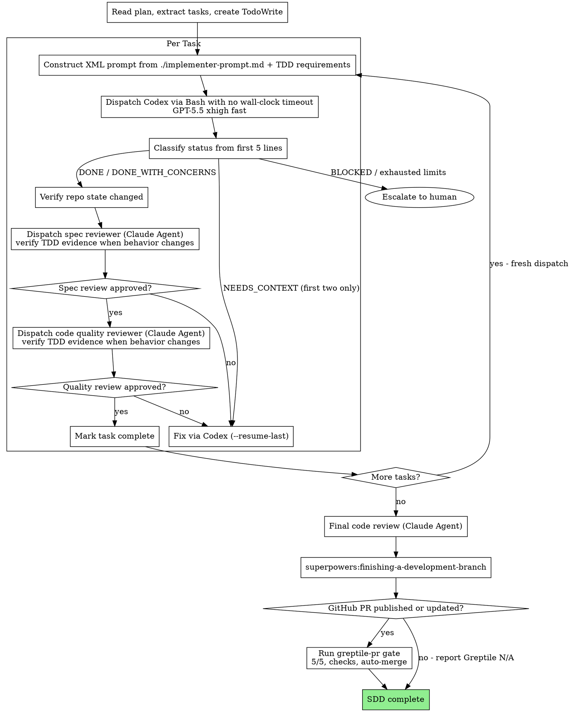

# Subagent-Driven Development

Execute plan by dispatching Codex implementer via Bash while Claude orchestrates + reviews. Every task still passes spec review first, then code-quality review.

## Convention Constants

- Model default: GPT-5.5 xhigh fast
- CLI model argument, when required: `--model cx/gpt-5.5 --effort high`

These are conventions for dispatch prompts and commands (easy to bump in one place), not hard-enforced runtime constants.

## Required TDD Companion

Implementation tasks in this SDD flow must use the `tdd` skill's red-green-refactor loop unless the task is docs-only, config-only, or otherwise changes no executable behavior.

TDD requirements:
- Tests verify behavior through public interfaces, not implementation details.
- Work in vertical tracer bullets: one failing behavior test, minimal implementation, then repeat.
- Do not write all tests first.
- Never refactor while RED; refactor only after tests are GREEN.

## Precondition Gate

Before Task 1, enforce clean tree:

```bash
if [ -n "$(git status --porcelain)" ]; then
  echo "BLOCKED: Working tree not clean. Commit, stash, or clean before starting SDD."
  exit 1
fi
```

## Known Limitation

Codex implementer in this flow has no MCP tool access, no interactive follow-up, no shared context window, and no streaming. Tasks requiring external tool interaction are not a fit for this path.

## The Process



## Codex Dispatch

### Path Resolution (portable)

```bash
CODEX_SCRIPT=$(node -e "
  const fs = require('fs');
  const base = process.env.HOME + '/.claude/plugins/cache/openai-codex/codex';
  const dirs = fs.readdirSync(base).filter(d => fs.statSync(base+'/'+d).isDirectory()).sort((a,b) => a.localeCompare(b, undefined, {numeric:true}));
  if (dirs.length) console.log(base+'/'+dirs[dirs.length-1]+'/scripts/codex-companion.mjs');
")
```

If empty or missing file (`! -f "$CODEX_SCRIPT"`), escalate:
"Codex plugin not found or script missing. Install/reinstall openai-codex plugin."

### Invocation

Fresh task:

```bash
node "$CODEX_SCRIPT" task "<prompt>" --write --model cx/gpt-5.5 --effort high
```

Fix/context cycle:

```bash
node "$CODEX_SCRIPT" task "<prompt>" --write --model cx/gpt-5.5 --effort high --resume-last
```

### Liveness and Waiting

Do not impose an absolute wall-clock timeout on a Codex worker. Do not use a
shell `timeout`, watchdog, or elapsed-time kill. A healthy long-running worker
must be allowed to finish.

- Omit the Bash tool timeout when supported, or use the host's maximum wait.
- If the host yields a live session, retain that session and poll it instead of
  starting a replacement worker.
- Poll worker liveness every 5 minutes (300 seconds). When supported, set the
  session wait/yield to 300000 ms.
- If the host enforces a shorter maximum wait, use its longest permitted wait
  and immediately resume the same session. Treat those interim host yields as
  wait continuation, not as additional liveness inspections or a reason to
  replace or terminate the worker.
- Treat a live process/session, growing worker log, new result output, or repo
  state changes as progress evidence.
- A long quiet interval is a reason to inspect liveness and saved evidence, not
  a reason to terminate the worker.
- Stop a worker only on explicit user cancellation, an actual non-zero exit,
  an unrecoverable auth/model/tool error, an explicit `Status: BLOCKED`, or a
  confirmed lost process/session with no valid handoff.
- If a tool call is interrupted externally, first inspect the existing session,
  result/log files, and repo state. Resume waiting when the worker is still
  alive; otherwise recover its artifacts through a fresh bounded continuation.

### Model errors

If stderr contains `model not found` or `invalid model`, escalate `"GPT-5.5 xhigh fast not available"`.

### Implementer prompt requirements

Each implementer prompt must state whether the task changes behavior or fixes a bug. If it does, require TDD evidence:
- name the public interface under test
- add one failing behavior test first
- implement the minimal code to pass that test
- repeat in vertical tracer bullets for additional behavior
- avoid bulk test-first passes
- refactor only after tests are GREEN

For docs-only, config-only, and no-code tasks, state why the TDD requirement does not apply.

### `--resume-last` fallback

If `--resume-last` dispatch errors (stale/corrupt session), retry once as fresh dispatch without `--resume-last`. This still increments total dispatch count.

### Prompt-size rule

Measure, do not guess:

```bash
printf '%s' "$prompt" | wc -c
```

If >4000 bytes, use `--prompt-file`.

## Status Classification (no heuristics)

Rules:
- Non-zero exit => BLOCKED
- Empty trimmed stdout => BLOCKED
- Parse first line matching this regex within first 5 lines:
  - `^Status:\s*(DONE|DONE_WITH_CONCERNS|NEEDS_CONTEXT|BLOCKED)\s*$`
- No regex match in first 5 lines => BLOCKED (no guessing)

DONE and DONE_WITH_CONCERNS continue to repo verification.

## Repo State Verification (required)

Before dispatch, snapshot:

```bash
HEAD_BEFORE=$(git rev-parse HEAD)
STATUS_BEFORE=$(git status --porcelain)
```

After DONE / DONE_WITH_CONCERNS:
- `HEAD_AFTER=$(git rev-parse HEAD)`
- `STATUS_AFTER=$(git status --porcelain)`

If `HEAD_BEFORE == HEAD_AFTER` and `STATUS_BEFORE == STATUS_AFTER`, reclassify BLOCKED:
"Codex claimed DONE but no repo state change"

## Error Handling

- Auth errors (`401|unauthorized|authentication failed|token expired`, case-insensitive):
  - Escalate: "Codex auth expired. Run `codex auth` in terminal, then retry."
- Model errors (`model not found|invalid model`):
  - Escalate: "GPT-5.5 xhigh fast not available."
- Network errors:
  - Retry with 5s backoff, max 2 retries
- Other stderr:
  - BLOCKED and include stderr in escalation note

### Output capture

Capture stdout and stderr. If output exceeds 8000 chars, truncate middle with marker:

- Keep first 3000 chars
- Insert `[... truncated N chars ...]`
- Keep last 3000 chars
- Always preserve parsed `Status:` line

## Counters and Limits (per task)

- NEEDS_CONTEXT: max 2
- Spec-review fix cycles: max 3
- Quality-review fix cycles: max 3
- Total Codex dispatches: max 8

Counting rule:
- Every `node "$CODEX_SCRIPT" task ...` invocation increments total
- Includes network retries
- Includes `--resume-last` fallback-to-fresh retry
- No exceptions

At limit: escalate to human and stop loop.

## Rollback on Exhausted Fix Cycles

Because clean-tree precondition is required, exhausted task rollback can stash all Codex changes:

```bash
git stash push -u -m "sdd-rollback-task-N"
```

Escalate with stash name:
"Task N exhausted fix cycles. Changes stashed as `sdd-rollback-task-N`. Review with `git stash show -p stash@{0}`."

## Reviewers (unchanged behavior)

Reviewer dispatch templates remain unchanged:
- `./spec-reviewer-prompt.md`
- `./code-quality-reviewer-prompt.md`

Order remains fixed:
1. Spec compliance review
2. Code quality review

When the task changes behavior or fixes a bug, both reviewer prompts must ask for TDD evidence: behavior tests through public interfaces, vertical tracer bullet progression, no horizontal "all tests first" pass, and no refactor while RED. For docs-only, config-only, and no-code tasks, reviewers should accept a clear non-applicability note.

## Greptile PR Gate

After every task and the final code review pass, run the branch-finishing workflow. If that outcome publishes or updates a GitHub pull request, read and follow `/Users/victortran/.claude/skills/greptile-pr/SKILL.md` before declaring SDD complete.

The PR gate requires:

- Greptile confidence `5/5` for the exact current PR head commit. A result for an older SHA is stale and does not count.
- All actionable Greptile and Copilot comments resolved or explicitly shown to be non-actionable with evidence.
- Every code fix dispatched through a fresh GPT-5.6 Sol medium-or-higher implementation worker, followed by fresh adversarial spec review and code-quality review in that order.
- Relevant verification rerun before each fix is committed and pushed.
- A fresh Greptile review of the new head after every pushed fix.
- Automatic merge once the exact current head has Greptile `5/5`, all actionable review comments are resolved, and required status checks pass. Do not pause for another human confirmation.

Allow at most 3 Greptile-driven fix cycles. If the limit is exhausted, Greptile is unavailable, or `5/5` cannot be tied to the current head, leave the PR open and escalate with the PR URL, current head SHA, review state, verification evidence, and remaining findings. Do not bypass the gate or describe the PR as merge-ready.

If the user chooses a local-only branch outcome, or there is no GitHub PR in scope, do not create or publish one solely to satisfy this gate. Report `Greptile N/A` and the reason.

## Thread Management

- New task => fresh dispatch (no `--resume-last`)
- Fix/context cycle in same task => `--resume-last`
- If `--resume-last` fails => retry fresh dispatch and continue

## TodoWrite Tracking

1. Read plan once, extract tasks with full text/context
2. Create TodoWrite for all tasks
3. Mark in progress before implementer dispatch
4. Mark complete only after both review gates pass

## Red Flags

Never:
- do manual implementation edits as controller
- do no parallel Codex dispatch in same worktree
- skip repo state verification
- skip spec review or quality review
- bypass fix re-review loops
- assume status without strict parser match
- start on dirty tree

Operational assumptions:
- single-agent ownership of working directory during SDD run
- use separate `git worktree` for parallel unrelated work
